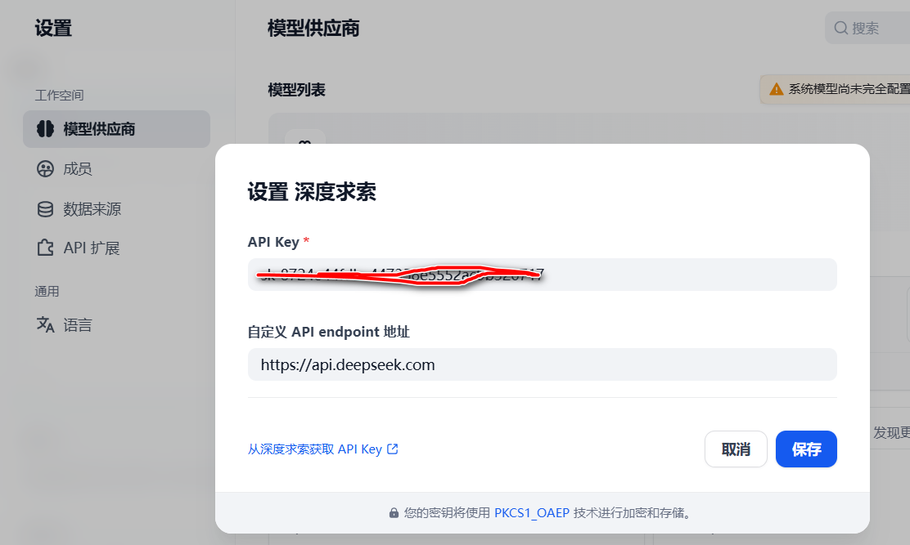

# Dify部署方式

## 1. 本地部署

### 1.1 Clone Dify

Clone the Dify source code to your local machine:

```
# Assuming current latest version is 1.1.2
git clone https://github.com/langgenius/dify.git -b 1.1.2 --depth 1
```


### 1.2 Starting Dify

Navigate to the Docker directory in the Dify source code

```
cd dify/docker
```

Copy the environment configuration file

```
cp .env.example .env
```

Start the Docker containers

Choose the appropriate command to start the containers based on the Docker Compose version on your system. 

```
docker compose up -d
```


### 1.3 访问Dify

当启动之后，直接访问[http://localhost/](http://localhost，首次访问的时候，会要求你设置管理员的信息。


当你登录成功之后，你将会看到如下的页面：


## 2. 创建应用接入在线DeepSeek

### 2.1 基于空白应用创建聊天助手


创建成功之后，你将会看到如下的页面：


### 2.2 设置DeepSeek在线大模型API Key

点击去设置，在模型广场找到深度求索：


安装成功之后，你将会看到在如下页面：


然后去配置API-KEY。



### 2.3 使用测试

